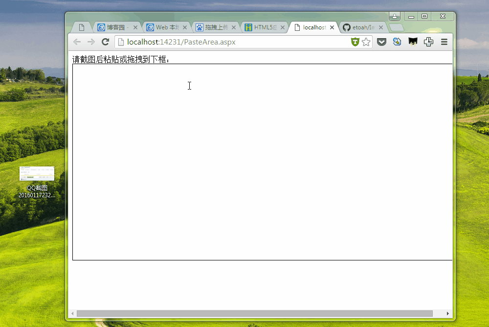
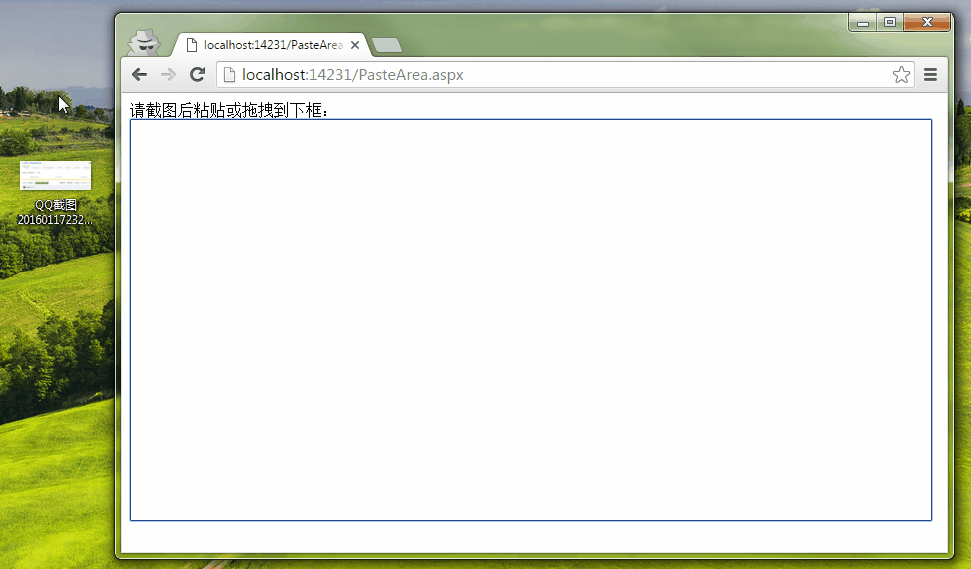
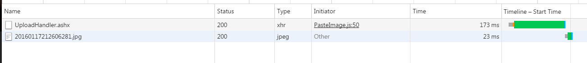

#图片上传插件：用HTML5 File API 实现截图粘贴上传、拖拽上传
##一 . 背景及效果
当前互联网上传文件最多的就是图片文件了，但是传统web图片的截图上传需要：截图保存->选择路径->保存后再点击上传->选择路径->上传->插入。      
图片文件上传也需要：选择路径再->上传->插入。步骤繁杂，互联网体验为王，如果支持截图粘贴上传、拖拽上传将大大提升体验。

首先看一下插效果:   
* 截图后直接粘贴上传。    
  

* 拖拽上传    
     
**http网络**     
 

##二.使用示例

####直接调用：
```html
<div id="box" style="width: 800px; height: 400px; border: 1px solid;" contenteditable="true"></div>
<script type="text/javascript" src="UploadImage.js"></script>

  new UploadImage("box", "UploadHandler.ashx").upload(function (xhr) {
                    var img = new Image();
                    img.src = xhr.responseText;
                    this.appendChild(img);
                });
```

####AMD/CMD
```html
<div id="box" style="width: 800px; height: 400px; border: 1px solid;" contenteditable="true"></div>
            <script type="text/javascript" src="require.js"></script>
            <script>
                require(['UploadImage'], function (UploadImage) {

                    new UploadImage("box", "UploadHandler.ashx").upload(function (xhr) {
                        var img = new Image();
                        img.src = xhr.responseText;
                        this.appendChild(img);
                    });

                })
            </script>
```

##三.浏览器支持
当前版本只支持以下，浏览器，后期可能会支持更多浏览器，如ie10等。
* IE11
* Chrome
* FireFox
* Safari(未测式，理论应该支持)

##四.原理及源码
1. 粘贴上传   
处理目标容器（id）的paste事件，读取e.clipboardData中的数据，如果是图片进行以下处理：
用H5 File API(FileReader)获取文件的base64代码，并构建FormData异步上传。
2. 拖拽上传    
处理目标容器（id）的drop事件，读取e.dataTransfer.files（H5 File API: FileList）中的数据，如果是图片并构建FormData异步上传。
    

 以下是初版本代码，比较简单。不再赘述。
###示例代码

```javascript
function UploadImage(id, url, key)
    {
        this.element = document.getElementById(id); 
        this.url = url; //后端处理图片的路径
        this.imgKey = key || "PasteAreaImgKey"; //提到到后端的name

    }
    UploadImage.prototype.paste = function (callback, formData) 
    {
        var thatthat = this;
        this.element.addEventListener('paste', function (e) {//处理目标容器（id）的paste事件

                if (e.clipboardData && e.clipboardData.items[0].type.indexOf('image') > -1) {
                    var that = this,
                        reader =  new FileReader();
                    file = e.clipboardData.items[0].getAsFile();//读取e.clipboardData中的数据：Blob对象

                    reader.onload = function (e) { //reader读取完成后，xhr上传
                        var xhr = new XMLHttpRequest(),
                            fd = formData || (new FormData());;
                        xhr.open('POST', thatthat.url, true);
                        xhr.onload = function () {
                            callback.call(that, xhr);
                        }
                        fd.append(thatthat.imgKey, this.result); // this.result得到图片的base64
                        xhr.send(fd);
                    }
                    reader.readAsDataURL(file);//获取base64编码
                }
            }, false);
    }

```
后端及详细代码请移动[github](https://github.com/etoah/ImgUploadJS):https://github.com/etoah/ImgUploadJS


##五. 其它功能
部份功能还在开发中，欢迎提建议或意见。


